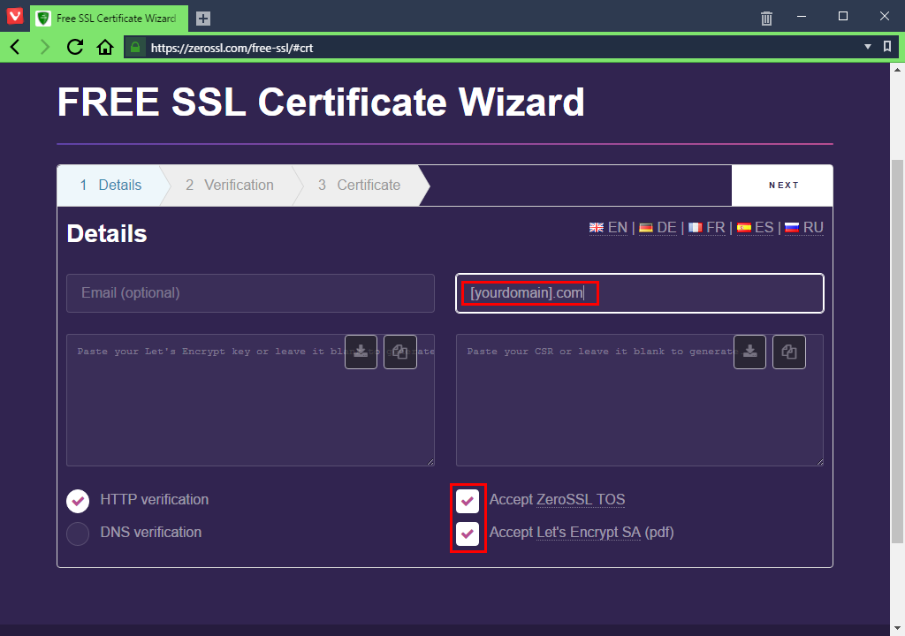
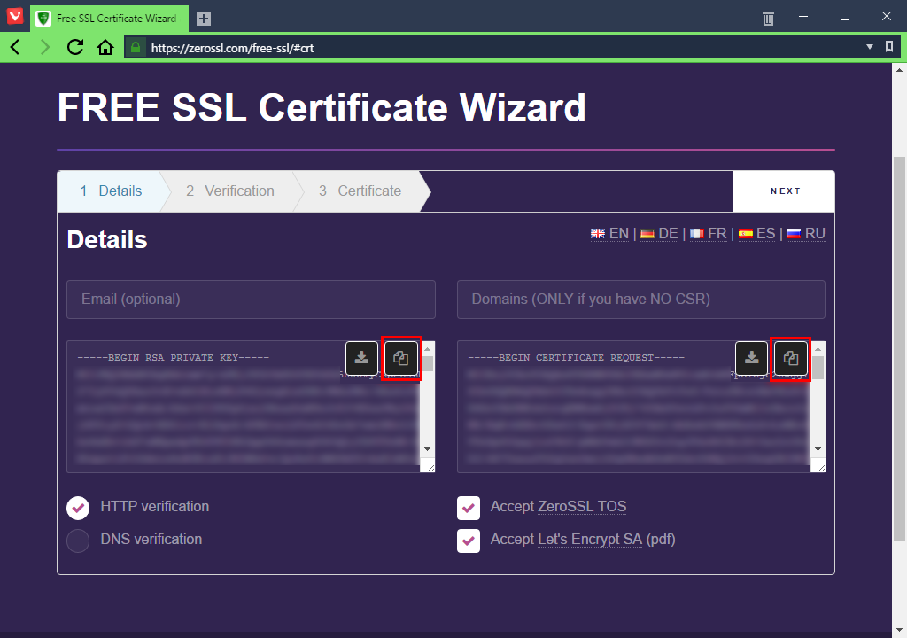
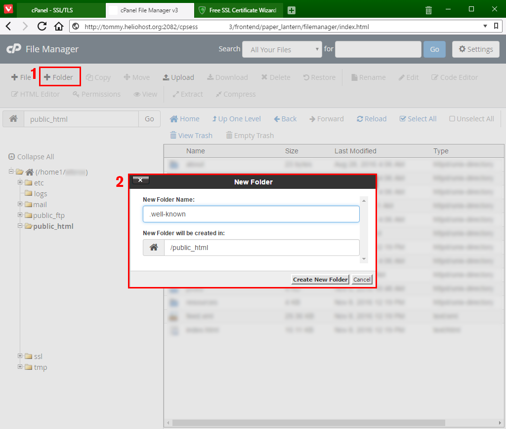
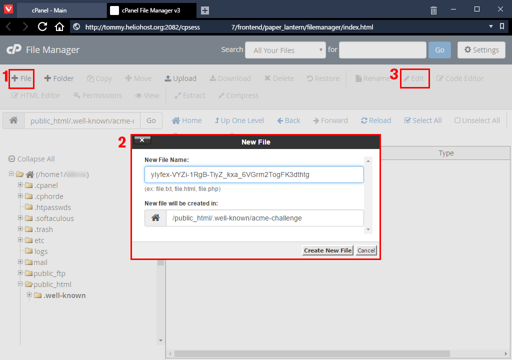
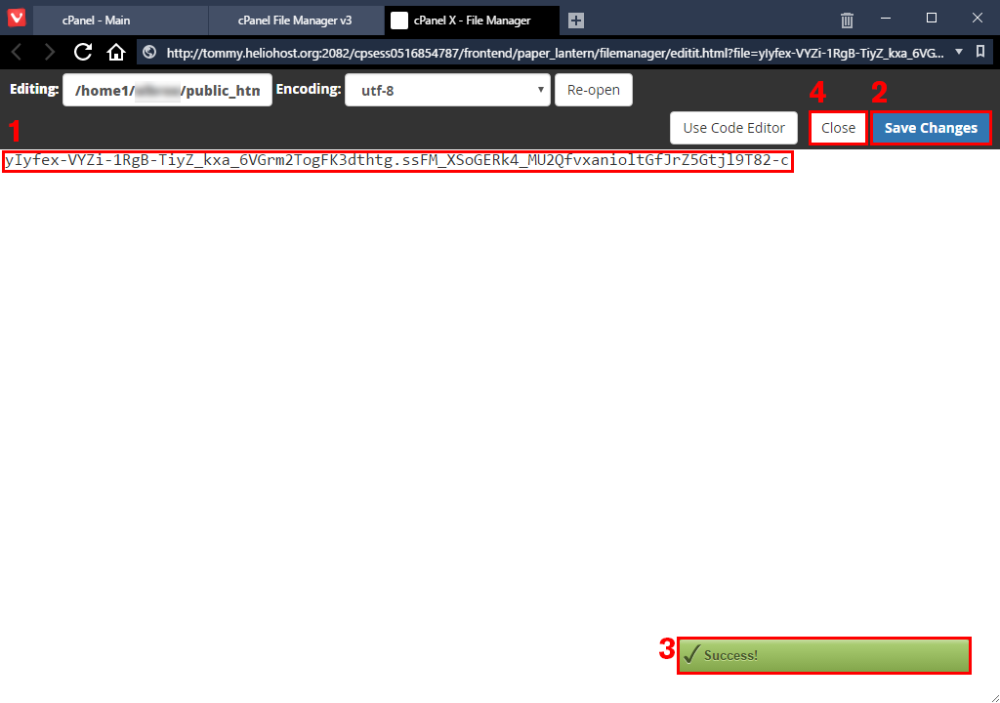
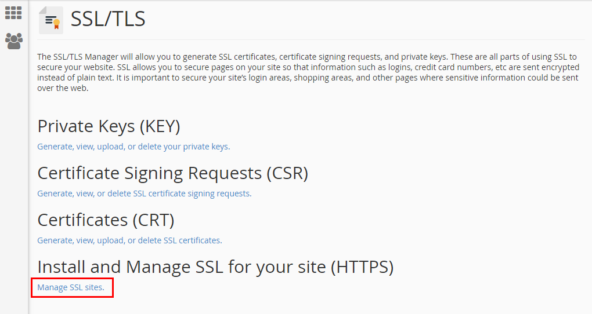

# Installing Let's Encrypt SSL Certificate via cPanel


This tutorial is outdated since ZeroSSL had revamped their site. You can still try to follow the tutorial but don't expect things to look the same.



This tutorial should only be done on Johnny! For Tommy and Ricky users, AutoSSL will generate a certificate for you within 24 hours and it will be renewed automatically.


### Step one: Obtain Key and CSR from ZeroSSL

Head over to the [ZeroSSL Certificate Wizard](https://zerossl.com/) to get started. Enter your domain name \(and any desired subdomains, space-delimited\) into the domain field as below. Additionally, enter your email address if desired. Check both acceptance boxes and leave “HTTP verification” selected.



Click “Next” at the top right of the form and approve the addition of the www prefix. This will ensure the certificate will work for www.\[yourdomain\].com as well as \[yourdomain\].com. Wait for the CSR to be generated. \(Once this is done, the domain field will be cleared automatically. Don’t panic – just leave it blank\). Click “Next” again to generate your RSA private key \(AKA private key\) and wait for this to complete.

**Important:** Now copy both the RSA price key and the CSR somewhere \(it doesn’t matter where, a text editor window will do\) for future reference using the clipboard buttons indicated in the screenshot. Alternatively, they can be downloaded as text files using the download buttons.



Click “Next”. At this point, the site will warn you if it suspects you haven’t saved the key and CSR – so make sure you have.

### Step two: Verify site ownership

The verification step will appear. The purpose of this step is to demonstrate domain ownership by creating known files into a certain location. Typically This can be achieved using cPanel as shown in the following steps. Alternatively, FTP or similar can be used. One file is required per domain. Here there are two: one for the domain with www and one for without.


Note: the remainder of this step involves creating folders and files through the cPanel file manager. An alternative such as FTP or WebDisk can be used if desired.

Open cPanel at [https://johnny.heliohost.org:2083](https://johnny.heliohost.org:2083/), and select Files -&gt; File Manager on the main page. The file manager should open.

Note: If you haven’t already, now is probably a good time to show hidden files and folders. Use the “Settings” button at the top right of the file manager to open the settings panel and enable this setting.

Create a new folder named `.well-known` in the `public_html` folder as shown in the screenshot.



Use the same process to create the `acme-challenge` folder in the `public_html/.well-known` directory.

In the `public_html/.well-known/acme-challenge` directory, create a file with the name in the “File” column from the ZeroSSL Verification page. Select and open this file with the “Edit” button.  




Paste the file text from the “Text” column corresponding to the file on the ZeroSSL verification page. The first section of text is typically identical to the file name. Save changes when done, then close the editor.



Repeat the file creation process for all the files from the ZeroSSL Verification page. There should be one per subdomain. In this case there are two files to be created: one for the base domain and one for the www-prefixed domain.

### Step three: Obtain and install certificate

Back in ZeroSSL, press “Next”. If all goes well the following should appear.


Use the copy or download buttons to store the certificate as before \(the most convenient location would be alongside the CSR and key\).

**Important:** Note that the certificate text you just saved is in a two-section form similar to the following:

```text
-----BEGIN CERTIFICATE-----
[encoded text A]
-----END CERTIFICATE-----

-----BEGIN CERTIFICATE-----
[encoded text B]
-----END CERTIFICATE-----
```

The first section of text \(including BEGIN and END lines\) is the “certificate” \(cPanel terminology\) and the second section of text \(including BEGIN and END lines\) is the CABUNDLE. Keep this in mind for the following steps, where the certificate will be installed on the domain through cPanel.

Open cPanel again at [https://johnny.heliohost.org:2083](https://johnny.heliohost.org:2083/). Select Security -&gt; SSL/TLS on the main page. On the following screen, select "Manage SSL Sites".



On the following page, scroll to the “Install an SSL website” section, where there are fields for Certificate, Private Key, and CABUNDLE. Select the appropriate domain and paste the relevant text into each field, as identified and stored in the earlier steps. The pasted text should include BEGIN and END lines. Note the CSR text is not required. “Enable SNI for Mail Services” can remain checked.

Submit the certificate information with the “Install Certificate” button at the bottom of the page.

Note: On Johnny it can take up to 2 hours for your SSL certificate to start working.

You should now have SSL up and running! HTTPS can be used on the domain/subdomains you specified.

### Additional steps \(optional\)

#### Certificate expiry and renewal

Certificates issued by Let's Encrypt, such as the one\(s\) you just generated with ZeroSSL expire after 90 days. Set a reminder to renew the certificate at an appropriate date.

#### Forced HTTPS

By default, pages can be accessed either unencrypted \(HTTP\) or encrypted \(HTTPS\). `.htaccess` rules can be used to force HTTPS throughout the site or on certain pages. More information can be found on [this httpd wiki page](https://wiki.apache.org/httpd/RewriteHTTPToHTTPS).

