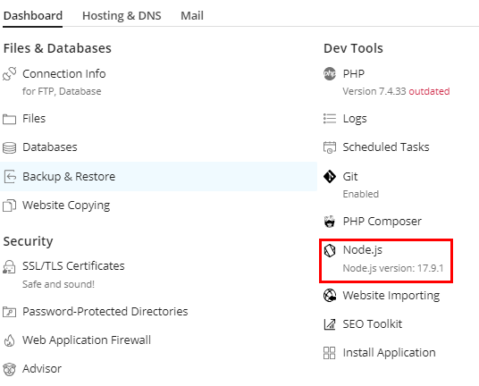
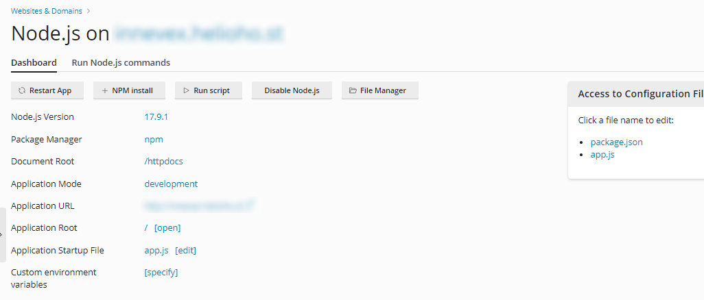
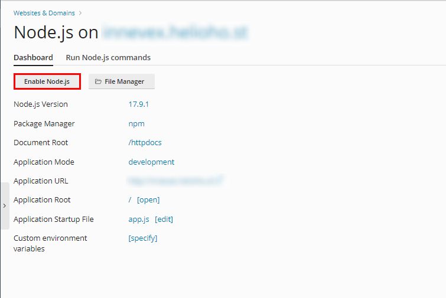
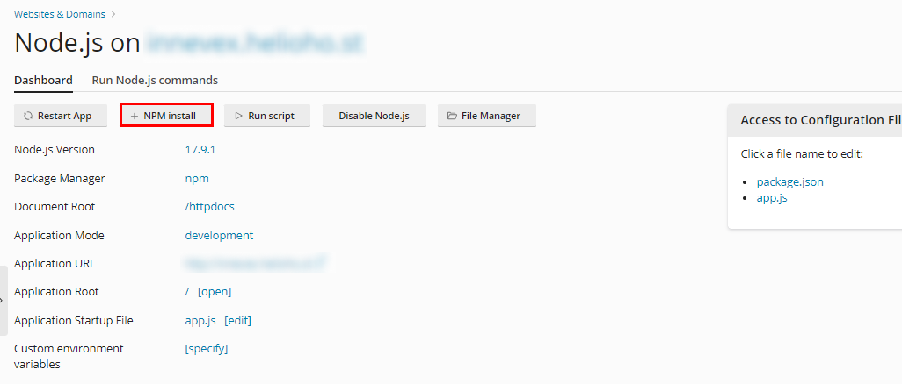

# Node.js

## Supported Versions

| Server | Node.js Version                                     |
|--------|-----------------------------------------------------|
| Tommy  | 8.17.0, 10.24.1, 12.22.12, 14.21.3, 16.19.1, 17.9.1 |
| Johnny | 12.22.12, 14.21.3, 16.19.1                          |

## About Node.js

Node.js is a powerful and popular runtime environment for executing JavaScript code server-side. It allows developers to build scalable and efficient web applications using JavaScript, which is traditionally used for front-end development.

## Setup

**Note: If you prefer visual guidance, we have a video tutorial available for you to watch. Click [here](https://www.youtube.com/watch?v=Ak2yI8w-mew&ab_channel=HelioHost){:target="_blank"} to access the video. If you want to follow the written instructions, please continue reading below.**

Go into your project root (if you don't have a project, you can use this example project [here](https://github.com/HelioNetworks/Node.JS-Example){:target="_blank"})


## How to setup Node.js

Your Node.js files will go into your user directory (NOT `httpdocs`).

```text
/
```


**Note: delete the content inside `httpdocs`**

if you don't use the example Create a new file `app.js` and put this inside:

```
const http = require('http');
const port = 3000;

const server = http.createServer((req, res) => {
  res.statusCode = 200;
  res.setHeader('Content-Type', 'text/html');
  res.end('Node.js is working.');
});

server.listen(port, () => {
  console.log(`Server running`);
});
```

In Plesk, go to "Website & Domains".


Under the domain you'd like to use for Node.js, select `Node.js`.



## Server setup
Upload all your files to your Tommy server. Then go to the Node.js section and set the following.

* Node.js Version: At least 14.21.0 tho i highly recommend using the latest one 17.9.1
* Application Root: / (folder where you uploaded your next project, i recommend / )
* Application Startup File: app.js (file we created earlier)
* Here, you're able to configure settings for your application.




## Starting the server

Once all of the above steps are done, you can press the Enable Node.js button.



Then you need to press the NPM install button.



After that finished you just need to wait for the server to update your account and start using Node.js, this may take a while.

In order for the Node.js application to be deployed, it requires an Apache restart, so this could take anywhere from a few minutes to a few hours. If it's been more than 2 hours, and it still isn't working, please
open [a customer service ticket](https://www.helionet.org/index/forum/45-customer-service/) and let us know.

Once the Node.js application has been deployed you should be able to go to `domain.helioho.st/` and see the
text `Node.js is working.`.
